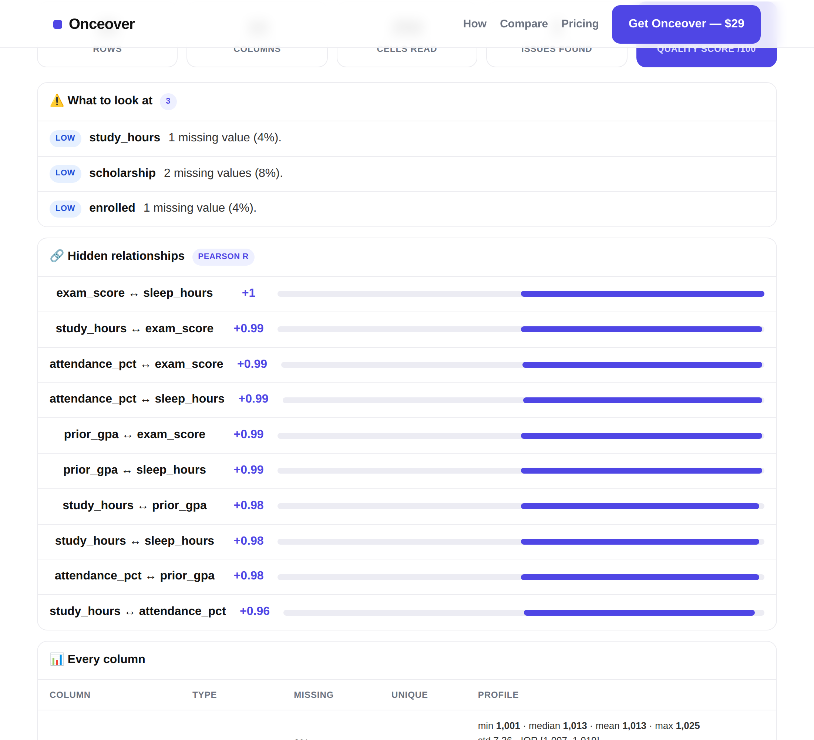

# Onceover

**Know any spreadsheet in 10 seconds — without uploading a single cell.**

Drop a CSV and Onceover profiles every column: type, missing %, unique values,
min/median/mean/max, outliers, distributions, and the Pearson correlations
hiding between your numbers. It runs entirely in your browser tab. Nothing is
uploaded, nothing is stored.



---

## Run it (one command)

```bash
npm start
```

Then open **http://localhost:4321** and either:

- **drop a CSV** onto the box, or
- click **“Try it with 25 students”** to load the bundled sample.

No `npm install` needed — there are **zero dependencies**. Just Node ≥ 18.

> Prefer a different port? `PORT=8080 npm start`

### 30-second demo path

1. `npm start`
2. Open http://localhost:4321
3. Click **“▶ Try it with 25 students”**
4. Read the result: 25 rows × 10 columns profiled, a quality score, the
   missing-data and outlier issues, and a ranked list of correlations
   (e.g. `study_hours ↔ exam_score  +0.99`).
5. Click **Download report (.json)** to take the full profile with you.

---

## What it actually computes

All of this is real logic in [`public/profile.js`](public/profile.js) — the same
module the browser uses and the tests exercise:

- **CSV parsing** that handles quoted fields, embedded commas, escaped `""`
  quotes, and `\n`/`\r\n`/quoted newlines.
- **Type inference** per column: integer, number, date, boolean
  (true/false/yes/no/1/0 collapsed), category, free text, or empty.
- **Per-column stats**: count, missing count + %, unique count + %,
  min/q1/median/mean/q3/max, standard deviation, zeros, negatives.
- **Outlier detection** via the 1.5×IQR rule.
- **Distributions** as 12-bucket histograms (the little sparklines).
- **Correlations**: Pearson `r` across every numeric pair, using pairwise
  complete rows, surfaced when `|r| ≥ 0.5`.
- **A data-quality score** (0–100) that penalizes missingness, constant
  columns, and empty columns.
- **Plain-English issues**: “37.5% of values are missing”, “every row has the
  same value”, “3 statistical outliers”, “negative value in a field that
  shouldn’t be negative”.

## Test it on a phone (no server)

```bash
npm run build
```

This bundles the entire app — engine + sample data — into a single
**`onceover-standalone.html`**. Open that one file in any browser (including a
phone, straight from `file://`) and it works fully offline: tap **“Try it”** or
pick a CSV from your Files app. Nothing uploads; there is no network code.

## Test it

```bash
npm test
```

23 zero-dependency assertions covering CSV edge cases, type inference, stats,
outliers, correlation, and quality scoring.

---

## Accounts & “who paid” (OAuth, no passwords)

The profiler is free and needs no account. Signing in unlocks **account
features** — saving profile reports to your account and (when you’ve paid)
keeping unlimited ones.

Login is **OAuth 2.0 Authorization Code + PKCE**, so you never store a
password and the provider (Google/GitHub) enforces its own 2FA. Out of the box
it runs against a **built-in mock identity provider** so the whole flow works
with `npm start` and zero setup. Point it at a real provider with env vars:

```bash
# GitHub
OAUTH_PROVIDER=github GITHUB_CLIENT_ID=... GITHUB_CLIENT_SECRET=... npm start
# Google
OAUTH_PROVIDER=google GOOGLE_CLIENT_ID=... GOOGLE_CLIENT_SECRET=... npm start
```
(Register the app’s callback as `http://localhost:4321/auth/callback`. Set
`SESSION_SECRET` to a random string in production.)

**How “who paid” is tracked without a separate login:** the OAuth identity *is*
the account. Each account row (`data/users.json`) carries a `paid` flag, the
`plan`, and an `orders[]` list. With no Stripe key set, **Upgrade** simulates an
order so you can see the flow. Try it:

1. `npm start` → open the app → **Sign in** → pick a test account.
2. Click **Try it with 25 students**, then **Save to my account**.
3. Try saving a second report — a **free account is capped at 1** (`402`).
4. Open your avatar menu → **Upgrade**. The order is recorded; saves go
   unlimited. The `paid: true` record now lives on your account row.

## Real payments: Stripe Checkout (one-time)

Set a Stripe secret key and the **Upgrade** button switches from simulate to a
real **Stripe Checkout** session (`mode=payment` — one-time, no subscription).
No `stripe` npm package is used; it’s the REST API over `fetch` plus HMAC
webhook verification in [`lib/stripe.js`](lib/stripe.js).

```bash
STRIPE_SECRET_KEY=sk_test_...  \
STRIPE_WEBHOOK_SECRET=whsec_... \
OAUTH_PROVIDER=github GITHUB_CLIENT_ID=... GITHUB_CLIENT_SECRET=... \
npm start
```

Local webhook testing with the Stripe CLI:

```bash
stripe listen --forward-to localhost:4321/webhooks/stripe
# copy the printed whsec_... into STRIPE_WEBHOOK_SECRET, restart, then:
stripe trigger checkout.session.completed
```

**The flow:**

1. User clicks **Upgrade** → `POST /api/checkout` creates a Checkout Session
   carrying `client_reference_id = <account uid>` and redirects to Stripe.
2. User pays on Stripe’s hosted page (Stripe handles the card + 3-D Secure /
   SCA — the bank-side 2FA on the payment itself).
3. Stripe calls `POST /webhooks/stripe`. The signature is verified against
   `STRIPE_WEBHOOK_SECRET`; on `checkout.session.completed` the `uid` from
   `client_reference_id` is matched to the account and `recordPurchase` flips
   `paid`. Fulfilment happens **here**, not on the browser redirect — so a user
   can’t unlock by hitting the success URL.
4. The browser returns to `/?purchased=1` and polls `/api/me` until `paid`
   flips, then unlocks unlimited saves.

Safeguards: webhook signatures are checked (bad signature → `400`), delivery is
**idempotent** (a replayed event won’t double-count), stale timestamps are
rejected (replay protection), and the dev simulate (`/api/buy`) is **disabled**
(`403`) whenever a real Stripe key is present — no free-unlock bypass.

### Auth endpoints

| Route | What it does |
|---|---|
| `GET /auth/login` | Start OAuth (sets a signed, 10-min PKCE/state cookie) |
| `GET /auth/callback` | Verify `state`, exchange code, open a 30-day session |
| `GET /auth/logout` | Clear the session |
| `GET /api/me` | Current account + whether Stripe is live (public-safe view) |
| `POST /api/checkout?plan=` | Create a Stripe Checkout session, return its URL |
| `POST /webhooks/stripe` | Signature-verified fulfilment (flips `paid`) |
| `POST /api/buy?plan=` | Dev simulate (disabled when Stripe is live) |
| `GET/POST/DELETE /api/reports` | List / save / remove account reports |

## Why your data stays put

The Node server ([`server.js`](server.js)) only serves three static files. It
has **no upload endpoint** — there is nowhere for your data to go. The
`FileReader` reads your CSV in the browser and `profile.js` does the math in the
same tab. Close the tab and it’s gone.

## Project layout

```
server.js            zero-dep server: static files + auth + account API
build.js             bundles everything into onceover-standalone.html
lib/
  session.js         HMAC-signed cookies (sessions + OAuth transaction)
  oauth.js           OAuth2 + PKCE; Google / GitHub / mock providers
  mockidp.js         built-in local identity provider (dev, zero setup)
  stripe.js          Stripe Checkout + HMAC webhook verify (no SDK)
  store.js           JSON account store (paid flag, orders, reports)
public/
  index.html         the page + UI
  profile.js         the engine: CSV parse + statistics (browser + Node)
  app-auth.js        optional account layer (self-disables offline)
  sample.csv         25-student demo dataset
  og.svg, favicon.svg
test/
  profile.test.js    engine: 23 assertions
  auth.test.js       cookies / PKCE / store: 24 assertions
  stripe.test.js     webhook verify / checkout params: 18 assertions
```

## License

MIT.
